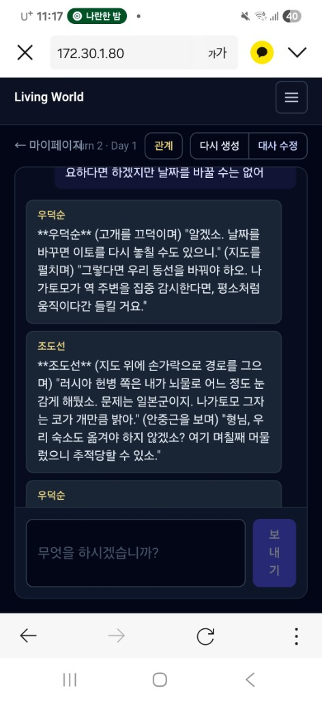
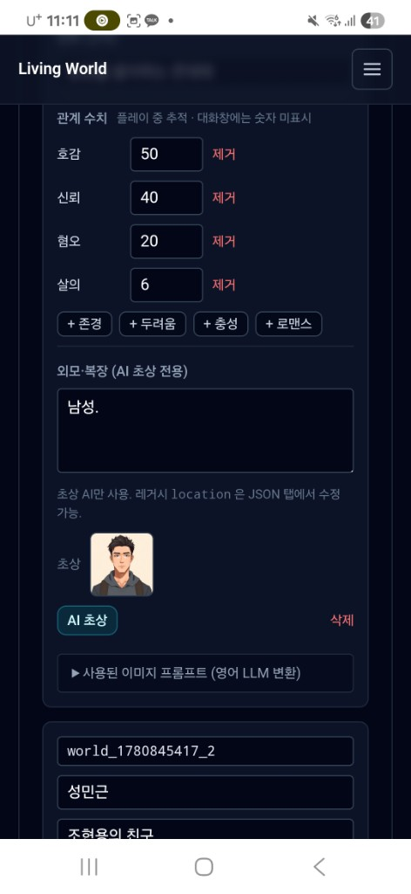
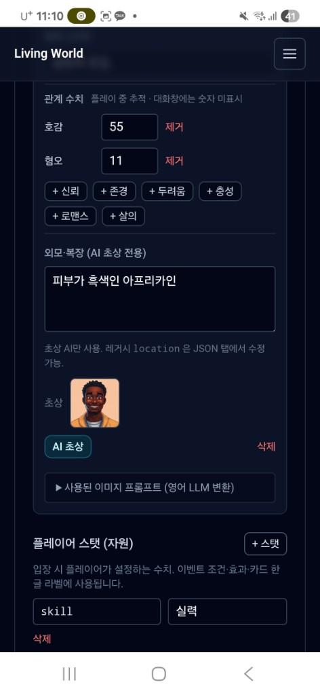
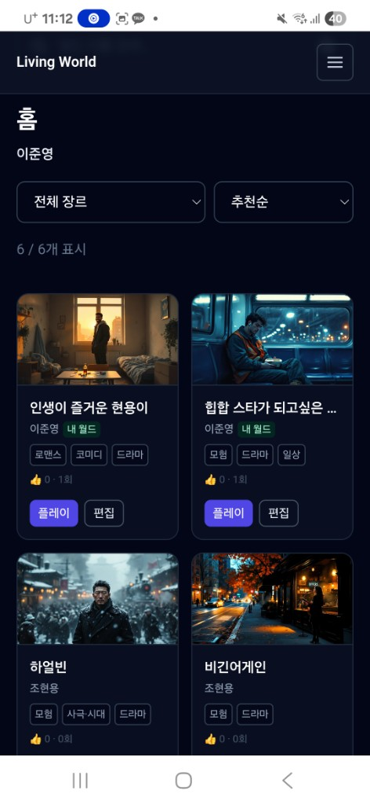
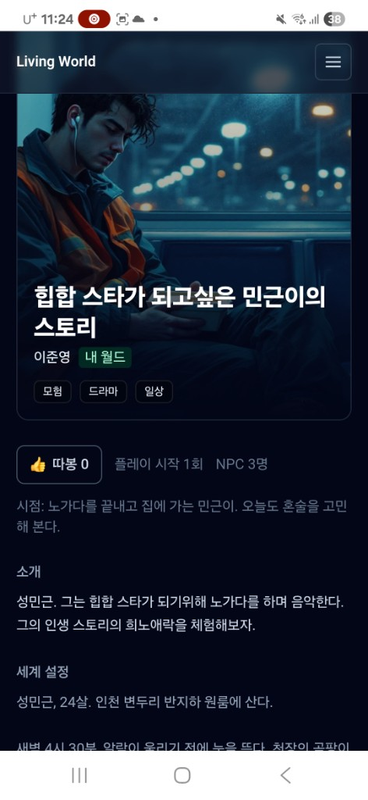
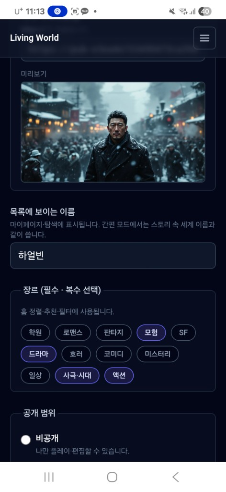
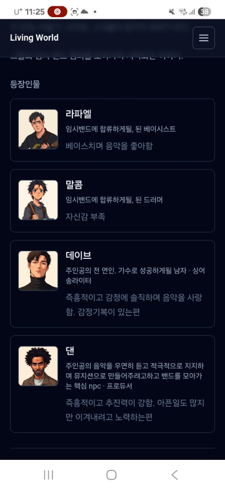
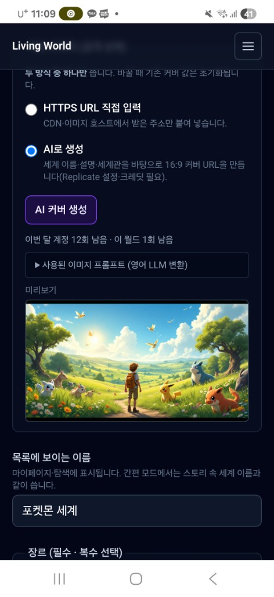

# 🌍 Living World Engine — AI 대화형 RPG 플랫폼

> **"LLM은 상태를 제안하고, 시스템이 검증한다"**

장기 기억 소실 · 상태 모순 · 비용 폭증을 **시스템 차원에서** 해결하는 Agentic AI 플랫폼

📅 **2025.12 ~ 2026.06** · 🧑‍💻 **1인 풀스택 개발**

[]()
[]()
[]()

---

## 📸 서비스 화면

| 대화 화면 | 월드 상태 | NPC·관계 편집 |
|:---:|:---:|:---:|
|  |  |  |

| 홈 · 탐색 | 월드 상세 | 월드 생성 |
|:---:|:---:|:---:|
|  |  |  |

| 등장인물 | AI 커버 생성 |
|:---:|:---:|
|  |  |

---

## 💡 문제 정의

기존 AI 챗봇(AI Dungeon, NovelAI 등)의 3대 한계:

| 문제 | 원인 | LWE 해결 |
|------|------|----------|
| 장기 기억 소실 | 컨텍스트 윈도우 한계 | **Canon Flags**로 사실 영속화 |
| 상태 모순 | LLM이 상태를 직접 변경 | **Validator**가 검증 후 반영 |
| 비용 폭증 | 매 턴 전체 히스토리 전송 | **Prompt Caching** 88% 적중 |

---

## 🏗 아키텍처

```
┌──────────┐   ┌──────────┐   ┌──────────────┐   ┌────────────┐
│  Client  │──▶│ FastAPI  │──▶│  GameEngine  │──▶│ Claude API │
│ React/TS │   │   API    │   │  (Tool Use)  │   │ Sonnet 4.5 │
└──────────┘   └────┬─────┘   └──────┬───────┘   └────────────┘
                    │                │
              ┌─────┴─────┐   ┌─────┴──────┐
              │ PostgreSQL │   │ Validator  │
              │            │   │ LoopDetect │
              └────────────┘   └────────────┘
```

### 1턴 8단계 파이프라인

`기억 검색` → `프롬프트 분리` → `Tool Use 호출` → `검증` → `상태 반영` → `이벤트 판정` → `서사 연출` → `화자 분할`

---

## ✨ 핵심 구현

### 🔧 Tool Use (LangChain 미사용)

- `update_game_state` **단일 툴**로 관계 8종 · 플래그 · 능력치 · 기억을 구조화 JSON으로 수신
- 디버깅 가능한 **화이트박스** 제어

### 🚩 Canon Flags

- 대화로 확정된 사실을 플래그로 **영속화**
- 프롬프트 최상단에 고정 → LLM 모순 **시스템 레벨 차단**

### ✅ StateChangeValidator

- 관계 변화량 상한(±3), reason 검증, flag 정규화
- LLM 출력의 **안전한 반영** 보장

### 🔄 LoopDetector

- 대화 반복 심각도 **1~10** 스코어링
- severity **7+** → 자동 서프라이즈 이벤트 주입

### 💰 Single-Pass + Prompt Caching

- 2차 호출 **조건부 생략** → API 호출 **50%** 절감
- static/dynamic 블록 분리 → 캐시 적중률 **88%**

---

## 📊 정량 성과

| 지표 | LWE | AI Dungeon | NovelAI |
|------|-----|------------|---------|
| 턴당 비용 | **$0.019** | $0.030~0.050 | $0.020~0.040 |
| 장기 세션 (150턴+) | ✅ $0.020 이하 유지 | ❌ 비용 선형 증가 | △ |
| 상태 모순 | ✅ Validator 차단 | ❌ 빈번 | ❌ 빈번 |

- **164턴** 실플레이 검증 완료
- 단위 테스트 **331건** 통과 (Mock LLM 기반)
- DB 마이그레이션 **15회**

---

## 🛠 기술 스택

| 영역 | 기술 |
|------|------|
| Backend | FastAPI, Python 3.11, Poetry |
| Frontend | React, TypeScript |
| Database | PostgreSQL |
| AI | Claude Sonnet 4.5, Tool Use API |
| Infra | Docker Compose, Sentry |
| Security | BYOK (Fernet), Rate Limiting, 비용 자동 차단 |
| Test | pytest, Mock LLM, 331 unit tests |

---

## 🚀 실행 방법

```bash
git clone https://github.com/leejunyoung0610/living-world-engine.git
cd living-world-engine
cp .env.example .env   # API 키 설정
docker-compose up -d
# http://localhost:3000
```

로컬 개발:

```bash
poetry install
poetry run python -m uvicorn backend.src.main:app --reload --port 8000
cd frontend && npm install && npm run dev
# → http://127.0.0.1:5173
```

---

## 📚 문서

| 문서 | 설명 |
|------|------|
| [docs/PORTFOLIO.md](docs/PORTFOLIO.md) | 지원서·자소서용 요약 |
| [docs/UGC_MVP_PLAN.md](docs/UGC_MVP_PLAN.md) | UGC 베타 MVP 기획 |
| [DEVELOPMENT.md](DEVELOPMENT.md) | 개발 일지 |

---

## 👤 Author

**이준영** — [GitHub @leejunyoung0610](https://github.com/leejunyoung0610)

개인 학습 및 **포트폴리오 목적** 프로젝트입니다.
