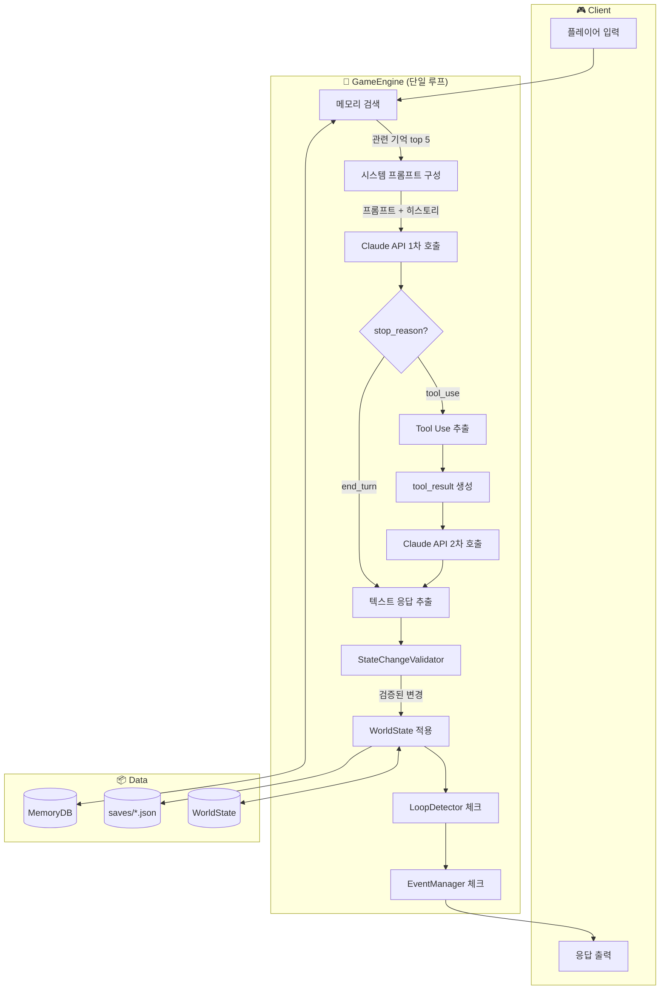

# Living World Engine - 시스템 아키텍처

> 핵심 질문: "AI 챗봇이 기억도 없고, 상태도 안 변하고, 같은 말만 반복하면?"
> 답: LLM에게 상태 변경을 맡기고, 시스템은 검증만 확실히 한다.

---

## 1. 전체 시스템 구조



### 한 턴의 흐름 (요약)

```
플레이어 입력
    ↓
① 메모리 검색 (키워드 매칭, 관련 기억 5개)
    ↓
② 시스템 프롬프트 구성 (세계 정보 + NPC 관계 + 기억)
    ↓
③ Claude API 1차 호출 → Tool Use 응답 (상태 변경 JSON)
    ↓
④ tool_result 반환 → Claude API 2차 호출 → 서사 텍스트
    ↓
⑤ Validator 검증 (변화량 제한, 캐릭터 확인)
    ↓
⑥ WorldState 적용 (관계 업데이트, 기억 추가)
    ↓
⑦ 루프 감지 (정체? 반복?) → 필요 시 이벤트 주입
    ↓
응답 반환
```

---

## 2. 핵심 컴포넌트

### GameEngine (`game_loop.py`)
**역할:** 모든 컴포넌트를 연결하는 오케스트레이터

```
GameEngine
├── WorldState      — 게임 상태 전체 관리
├── KeywordMemory   — 기억 저장 & 검색
├── ClaudeClient    — LLM 통신 (Tool Use)
├── Validator       — 상태 변경 검증
├── LoopDetector    — 루프 감지
└── EventManager    — 이벤트 트리거
```

하나의 `process_turn()` 메서드가 전체 턴을 처리합니다.
분산된 레이어 간 호출이 아니라, **순차적 파이프라인**입니다.

---

### WorldState (`state.py`)
**역할:** 게임 세계의 모든 상태를 관리하는 단일 진실의 원천 (Single Source of Truth)

```python
WorldState
├── world: dict       # 세계 변수 (chaos_level, faction_balance 등)
├── player: dict      # 플레이어 정보 (스탯, 플래그, 관계)
├── npcs: list        # NPC 목록 (성격, 위치, 기억)
├── quests: list      # 퀘스트 목록
├── turn: int         # 현재 턴
├── day: int          # 현재 일차
└── memories: list    # 축적된 기억
```

**핵심 메서드:**
- `get_relationship(npc_id, stat)` — 관계 수치 조회
- `update_relationship(npc_id, stat, change)` — 0-100 범위 클램핑
- `apply_changes(changes)` — 검증된 상태 변경 일괄 적용
- `snapshot()` — LLM 컨텍스트용 상태 요약

**설계 원칙:** 상태 변경은 반드시 `apply_changes()`를 통해서만 가능.
직접 딕셔너리를 수정하지 않음 → 모든 변경이 추적 가능.

---

### ClaudeClient (`llm.py`)
**역할:** Anthropic Claude API 통합, 올바른 Tool Use 2단계 호출

```
                    ┌─────────────────┐
                    │  1차 호출        │
  user_input ──────►│  messages +     │
  system_prompt ───►│  tools 정의     │
                    └────────┬────────┘
                             │
                    ┌────────▼────────┐
                    │  stop_reason?   │
                    └───┬─────────┬───┘
                        │         │
               tool_use │         │ end_turn
                        │         │
               ┌────────▼───┐  ┌──▼──────────┐
               │ state_changes│  │ 텍스트 반환  │
               │ 추출        │  │ (tool_used   │
               └────────┬───┘  │  = false)    │
                        │      └──────────────┘
               ┌────────▼────────┐
               │  2차 호출        │
               │  messages +     │
               │  tool_result    │
               └────────┬────────┘
                        │
               ┌────────▼────────┐
               │  최종 텍스트 +   │
               │  state_changes  │
               │  (tool_used     │
               │   = true)       │
               └─────────────────┘
```

**Tool 정의 (`update_game_state`):**
```json
{
  "relationship_changes": [
    {"character": "엘레나", "stat": "affection", "change": 5, "reason": "선물"}
  ],
  "new_memories": [
    {"content": "꽃을 선물 받았다", "emotion": "joy", "importance": 7}
  ]
}
```

LLM은 자유롭게 값을 제안하고, Validator가 범위를 제한합니다.
→ LLM의 창의성과 시스템의 안정성을 동시에 확보.

---

### StateChangeValidator (`validator.py`)
**역할:** LLM이 제안한 상태 변경을 게임 밸런스 범위 내로 제한

```
LLM 제안                    Validator 결과
─────────────────           ─────────────────
character: "엘레나"     →   ✅ 존재하는 NPC
character: "없는캐릭터"  →   ❌ 거부 (drop)
stat: "affection"       →   ✅ 유효한 스탯
stat: "power_level"     →   ❌ 거부 (drop)
change: +50             →   ✅ → +10 (클램핑)
change: -30             →   ✅ → -10 (클램핑)
importance: 99          →   ✅ → 10 (클램핑)
emotion: "asdf"         →   ✅ → "neutral" (대체)
content: ""             →   ❌ 거부 (drop)
```

**3단계 검증:**
1. **존재 검증** — NPC가 실제로 존재하는지
2. **유효성 검증** — 스탯, 감정 태그가 허용 목록에 있는지
3. **범위 제한** — 수치가 허용 범위를 벗어나면 클램핑

---

### LoopDetector (`loop_detector.py`)
**역할:** 대화가 정체되거나 반복되면 감지

```
최근 5턴 상태 변화량 합산
       │
       ▼
  < 0.05 (임계값)?  ──YES──►  🚨 상태 정체 감지
       │
       NO
       │
현재 응답 vs 이전 응답 유사도
       │
       ▼
  > 0.8 (Jaccard)?  ──YES──►  🚨 대사 반복 감지
       │
       NO
       │
       ▼
  ✅ 정상 진행
```

**감지 시 대응:** EventManager가 강제 이벤트를 주입하여 서사 전환.
예) "결투장에서 갑자기 종이 울린다. 공식 결투가 선포되었다."

---

### KeywordMemorySearch (`memory.py`)
**역할:** 벡터 DB 없이 관련 기억을 검색

```
쿼리: "엘레나와 결투장"
         │
         ▼
┌─ 키워드 추출 ──────────────┐
│  ["엘레나와", "결투장"]     │
│  (불용어 "에서" 등 제거)    │
└─────────────┬──────────────┘
              │
              ▼
┌─ 각 기억과 점수 계산 ──────┐
│                             │
│  키워드 매칭  × 0.5         │
│  + 중요도     × 0.3         │
│  + 최신도     × 0.2         │
│  = 종합 점수                │
└─────────────┬──────────────┘
              │
              ▼
┌─ 점수 상위 5개 반환 ───────┐
│  1. "엘레나와 결투장에서..  │
│  2. "결투장에서 시합을..    │
│  3. ...                     │
└─────────────────────────────┘
```

**왜 벡터 DB가 아닌가:**
- 게임 세션당 기억 = 수십~수백 건 → 벡터 검색은 오버킬
- 외부 의존성 제로 (ChromaDB, FAISS 등 불필요)
- 키워드 매칭이 한국어에서 충분히 효과적

---

### EventManager (`events.py`)
**역할:** 조건 기반 이벤트 트리거 + 쿨다운 관리

```json
{
  "id": "rivalry_clash",
  "condition": {"type": "variable_threshold", "variable": "rivalry_index", "op": ">=", "value": 0.5},
  "effects": [
    {"type": "world_variable", "key": "chaos_level", "change": 0.1}
  ],
  "cooldown": 5
}
```

**쿨다운 시스템:** 한번 트리거된 이벤트는 N턴 동안 재트리거 차단
→ ai_s의 이벤트 중복 누적 문제 해결

---

## 3. ai_s → 새 engine 아키텍처 변화

### Before (ai_s): 3-Layer + 다중 엔진

```
Player Input
    ↓
┌── Layer 2: Interpretation ──┐
│   ActionParser → Intent     │
│   PromptCompiler            │
└──────────────┬──────────────┘
               ↓
┌── Layer 3: World ───────────┐
│   WorldEngine.tick()        │
│   RuleEngine.evaluate()     │  ← 각각 독립적으로 state diff 생성
│   NPCBehavior.update()      │
└──────────────┬──────────────┘
               ↓
┌── StateReducer ─────────────┐
│   diff 1 (world) +          │
│   diff 2 (rules) +          │  ← 여기서 우선순위 충돌 발생!
│   diff 3 (npc) +             │
│   diff 4 (llm)               │
└──────────────┬──────────────┘
               ↓
┌── Layer 1: Narrative ───────┐
│   StoryLLM.generate()       │
│   ExpressionEngine          │
└──────────────┬──────────────┘
               ↓
           Response
```

**문제:**
- StateReducer에서 4개 소스의 diff가 충돌
- NPC behavior가 LLM의 관계 변화를 덮어씌움
- 어디서 버그가 생겼는지 추적 불가능

### After (새 engine): 단일 파이프라인

```
Player Input
    ↓
┌── GameEngine.process_turn() ──┐
│                                │
│   ① Memory.search()           │
│         ↓                      │
│   ② build_system_prompt()     │
│         ↓                      │
│   ③ Claude.process_turn()     │  ← 상태 변경의 유일한 소스
│         ↓                      │
│   ④ Validator.validate()      │  ← 검증만 담당
│         ↓                      │
│   ⑤ WorldState.apply()        │
│         ↓                      │
│   ⑥ LoopDetector.check()     │
│         ↓                      │
│   ⑦ EventManager.check()     │
│                                │
└────────────┬───────────────────┘
             ↓
         Response
```

**장점:**
- 상태 변경 소스가 LLM **하나뿐** → 충돌 불가능
- 순차적 파이프라인 → 디버깅이 쉬움 (어느 단계에서 문제인지 바로 파악)
- 각 단계가 독립적 → 유닛 테스트 용이

---

## 4. 설계 결정 이유

### 왜 단일 루프인가?
> ai_s에서 3-Layer 간 상태 diff가 충돌하는 문제를 겪었습니다.
> 근본 원인은 "여러 시스템이 독립적으로 상태를 변경"하는 구조였습니다.
> 단일 루프로 바꾸면 상태 변경 소스가 하나(LLM)로 통일되어
> 충돌이 원천적으로 불가능합니다.

### 왜 Tool Use인가?
> ai_s는 LLM 텍스트에서 `<NPC_EMOTION>` 같은 태그를 파싱했는데,
> LLM이 태그를 빠뜨리거나 형식을 틀리면 파싱이 실패했습니다.
> Tool Use는 LLM이 **구조화된 JSON 스키마**에 맞춰 응답하므로
> 파싱 에러가 원천 차단됩니다.
> 또한 상태 변경(Tool Use)과 서사 텍스트(2차 응답)가 분리되어
> 각각 독립적으로 검증할 수 있습니다.

### 왜 FSM을 제거했나?
> ai_s의 NPC FSM은 상태 전이 규칙이 플레이어 행동을 반영하지 못해
> 항상 "challenge" intent로 고착되었습니다.
> FSM을 고치려면 상태 전이 테이블 전체를 재설계해야 했는데,
> 근본적으로 "유한한 규칙으로 무한한 대화 맥락을 처리"하는 것이 한계였습니다.
> LLM에게 위임하면 대화 맥락, 관계 수치, 이전 기억을 종합적으로 판단하여
> 자연스러운 반응을 생성합니다.

### 왜 벡터 DB가 아닌가?
> 게임 세션당 기억이 수십~수백 건 수준이므로 벡터 검색은 오버킬입니다.
> 키워드 매칭(50%) + 중요도(30%) + 최신도(20%) 조합이
> 이 규모에서 충분히 효과적이고, 외부 의존성이 제로입니다.

---

## 5. 파일 구조와 컴포넌트 매핑

```
backend/src/
├── engine/                      # 핵심 엔진
│   ├── game_loop.py             # GameEngine (오케스트레이터)
│   ├── state.py                 # WorldState (상태 관리)
│   ├── memory.py                # KeywordMemorySearch (메모리 검색)
│   ├── llm.py                   # ClaudeClient (LLM 통합)
│   ├── validator.py             # StateChangeValidator (검증)
│   ├── loop_detector.py         # LoopDetector (루프 감지)
│   └── events.py                # EventManager (이벤트)
│
├── api/                         # REST API (Week 3)
│   └── routes/
│
├── worlds/                      # 세계관 데이터
│   └── arcane_academy/
│       ├── world.json           # 세계 설정 + 변수
│       ├── characters.json      # NPC 6명 (성격, 스킬, 말투)
│       └── events.json          # 이벤트 10개 (조건, 효과, 쿨다운)
│
└── utils/                       # 유틸리티
    ├── config.py                # 환경 설정 (Pydantic Settings)
    └── logger.py                # 로깅
```
